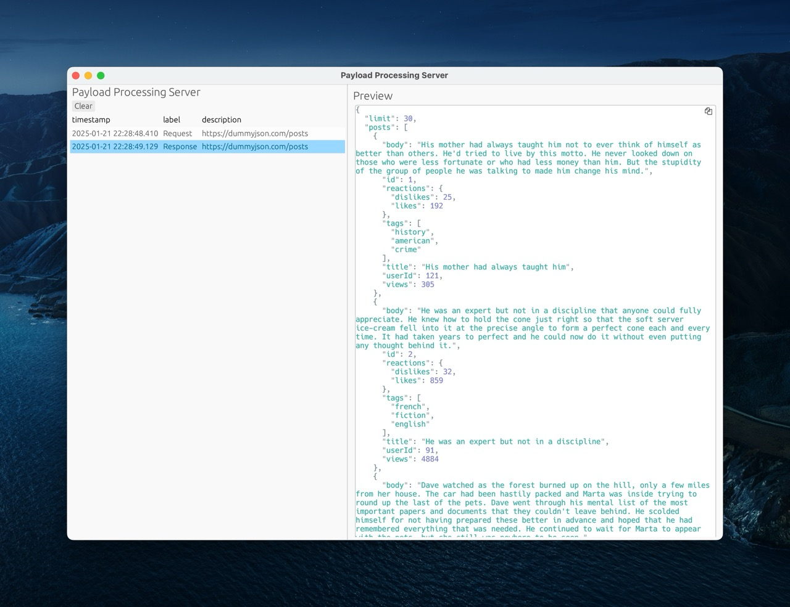

# Rust Ray CLI

A macOS desktop application that receives debug events from Ray PHP/Laravel applications and displays them in a native GUI using the gpui framework.



## Key Features

- **Native macOS GUI:** Built with [gpui](https://github.com/zed-industries/gpui) for optimal performance
- **Event Processing:** Three-layer architecture for clean data processing and presentation
- **Multiple Event Types:** Support for cache, HTTP, log, query, exception, and application log events
- **Minimalist Design:** Clean, shadcn-inspired aesthetic with typography-first approach
- **Real-time Updates:** Live event streaming from Ray applications

## Requirements

- **macOS only** (gpui is currently macOS-specific)
- **Full Xcode installation** (for Metal shader compiler)
- **Nightly Rust compiler** (uses experimental trait upcasting)

## Installation & Usage

### Running the Application

```bash
# Run the application
cargo run

# Quick test run (5 seconds)
timeout 5s cargo run
```

### Development Commands

```bash
# Run tests
cargo test

# Check code
cargo check

# Format code
cargo fmt

# Lint code
cargo clippy
```

## Ray Integration

Configure your Ray application to send events to `localhost:23517` (default Ray port).

**Important:** Apply the following patch to `vendor/spatie/ray/src/ArgumentConverter.php` to bypass Symfony tags:

```php
// Bypass Symfony tags for direct processing
return $argument;
```

## Architecture

This application uses a **three-layer Event-Processor-Renderer architecture**:

```
JSON Event → Processor → Structured Data → UI Renderer → gpui Components
```

### Layer 1: Event Processors (`src/events/processors/`)
- **Purpose:** Pure data extraction from JSON payloads
- **One processor per event type:** `cache.rs`, `http.rs`, `log.rs`, `query.rs`, `exception.rs`, `application_log.rs`, `table.rs`
- **Output:** Structured data types defined in `src/events/types.rs`

### Layer 2: Structured Data Types (`src/events/types.rs`)
- **Purpose:** Clean data structures without presentation logic
- **Types:** `CacheEvent`, `HttpEvent`, `LogEvent`, `QueryEvent`, `ExceptionEvent`, `ApplicationLogEvent`, `TableEvent`

### Layer 3: Event Renderers (UI Functions in `src/events/`)
- **Purpose:** Pure presentation logic, converts structured data to UI components
- **One renderer per event type:** Located in main event files
- **Output:** gpui Div components with minimalist styling for display

## Core Components

1. **HTTP Server** (`src/server.rs`): Listens on port 23517 for Ray events
2. **Event Processing** (`src/events/`): Three-layer architecture for processing events
3. **Event Storage** (`src/event_storage.rs`): Central storage with structured logging
4. **GUI Application** (`src/app.rs`): Main application using gpui framework
5. **UI Components** (`src/ui_components.rs`): Reusable UI elements and styling

## Adding New Event Types

To add a new event type, follow the three-layer pattern:

1. **Create Data Type** in `src/events/types.rs`
2. **Create Processor** in `src/events/processors/`
3. **Create UI Renderer** in main event file
4. **Update Module Files** to register the new type

See `CLAUDE.md` for detailed implementation examples.

## UI Design Philosophy

- **Minimalist, shadcn-inspired aesthetic** with clean typography and generous whitespace
- **Color palette:** zinc-based (zinc-950 background, zinc-800 borders, zinc-50/zinc-400 text)
- **Typography-first approach:** Use font weight, size, and color for hierarchy
- **Subtle interactions:** Text-only buttons with opacity/color hover effects
- **No cards or excessive borders:** Use spacing for visual separation

## Navigation

Use the `↑` and `↓` keys to navigate table rows.

## Development Notes

- **Error Handling:** Never use `unwrap()` - always use `?` to propagate errors
- **File Organization:** Prefer `src/module.rs` over `src/module/mod.rs`
- **Code Quality:** Prioritize correctness and clarity over speed
- **Safety:** Be careful with indexing and handle async operation failures

## Resources

- **GPUI Examples:** https://github.com/zed-industries/zed/tree/main/crates/gpui/examples
- **Ray Documentation:** https://spatie.be/docs/ray

## License

This project is open source and available under the [MIT License](LICENSE).